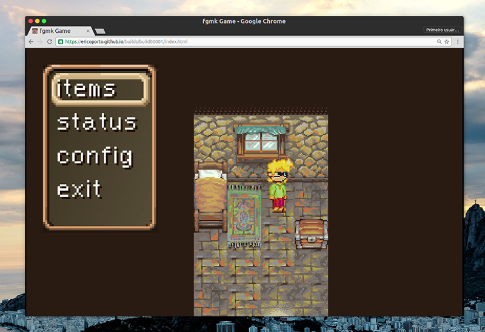

 fangamk
=============================

WORK IN PROGRESS IGNORE THIS REPO FOR NOW

This is a way describe a type of game in json files, a javascipt engine to play
it and a pyqt application to make it.

Engine demo
----------

Use WASD to move and IJ to interact in this demo: https://ericoporto.github.io/builds/build00001/index.html

If you are in a computer, this demo is compatible with a Xbox360 gamepad, just
plug it in the usb port of your computer and you are good to go.

Maker
-----

You can get the source here: https://github.com/ericoporto/fgmk

Releases are available here: https://github.com/ericoporto/fgmk/releases

Right now this code is using PyQt on the maker side, so assume everything here
is GPLv2.

Descriptors
-----------

The engine plays files that are basically json files and png images organized in
a certain folder structure. I am explaining this in the text right [here](Descriptor/README.md).
